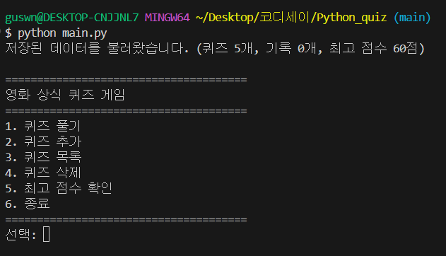
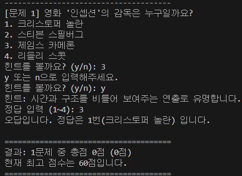
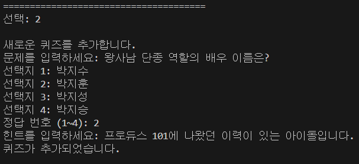
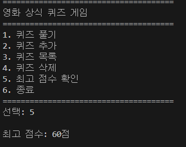
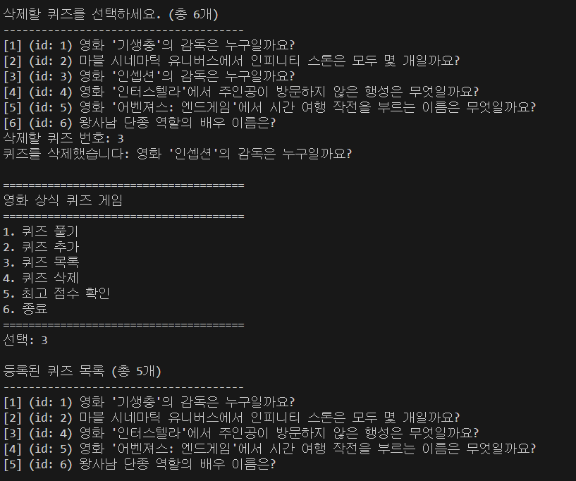
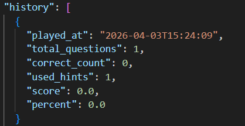
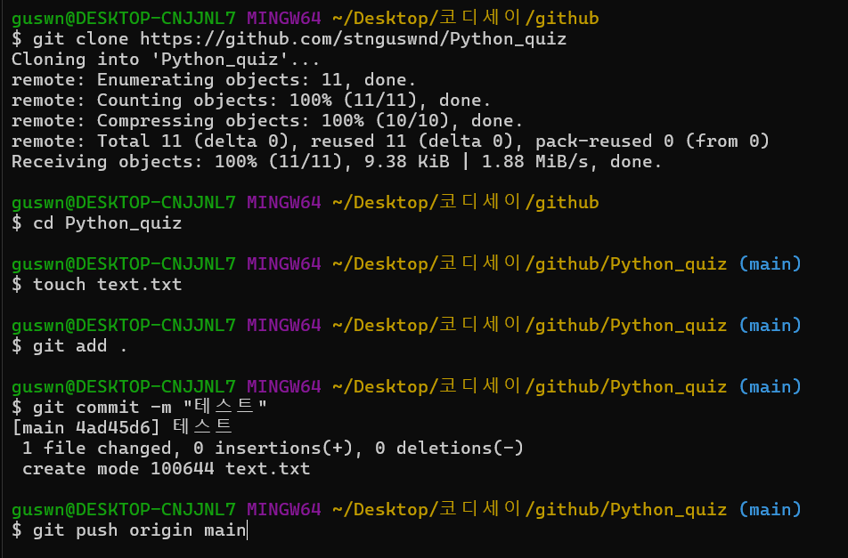
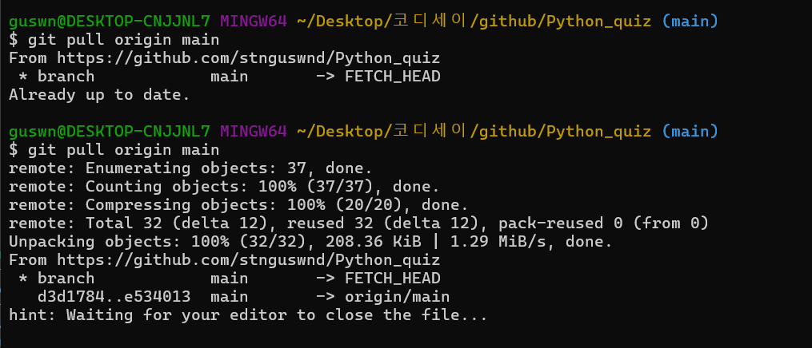
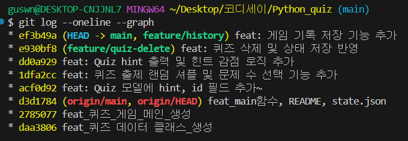

# Git과 함께하는 Python 첫 발자국

## 1. 프로젝트 개요

이 프로젝트는 Python으로 만든 콘솔 기반 퀴즈 게임입니다.
사용자는 메뉴를 통해 퀴즈를 풀고, 새로운 퀴즈를 추가하고, 등록된 퀴즈 목록을 확인하고, 최고 점수를 조회할 수 있습니다. 또한 `state.json` 파일을 사용해 퀴즈 데이터, 최고 퍼센트, 게임 기록을 저장하도록 구현해 프로그램을 종료한 뒤 다시 실행해도 이전 상태가 유지되도록 구성했습니다.

이번 과제의 핵심 목표는 다음 세 가지를 직접 경험하는 것입니다.

- Python 기본 문법으로 동작하는 프로그램 만들기
- 클래스(`Quiz`, `QuizGame`)로 역할을 나누어 구조화하기
- Git으로 기능 단위 커밋, 브랜치 생성, 병합 기록 남기기

---

## 2. 퀴즈 주제 선정 이유

퀴즈 주제는 `영화 상식`입니다.

영화는 평소에도 자주 접하는 분야라 문제를 직접 만들기 좋았고, 감독, 작품, 설정, 시리즈 관련 내용처럼 다양한 방식으로 문제를 확장할 수 있어 퀴즈 게임 주제로 적합하다고 판단했습니다. 또한 4지선다형 문제를 만들기에도 자연스럽고, 난이도를 조절하기 쉬워 콘솔 기반 퀴즈 게임의 주제로 사용했습니다.

---

## 3. 개발 환경

- Python 3.10 이상
- 표준 라이브러리만 사용
- 실행 환경: 터미널 / 콘솔

---

## 4. 실행 방법

### 1) 저장소 클론

```bash
git clone [본인 저장소 주소]
cd Python_quiz
```

### 2) 프로그램 실행

```bash
python main.py
```

환경에 따라 아래 명령어를 사용할 수도 있습니다.

```bash
python3 main.py
```

---

## 5. 기능 목록

### 필수 기능

- 메뉴 출력 및 번호 선택
- 퀴즈 풀기
- 퀴즈 추가
- 퀴즈 목록 확인
- 최고 점수 확인
- 최고 기록 리셋
- 프로그램 종료
- `state.json` 저장 / 불러오기
- 잘못된 입력 처리
- `Ctrl+C`, `EOFError` 예외 처리

### 보너스 기능

- 퀴즈 출제 순서 랜덤 셔플
- 사용자가 풀 문제 수 선택
- 힌트 출력 기능
- 힌트 사용 시 점수 차감
- 퀴즈 삭제 기능
- 게임 기록(`history`) 저장 기능
- 최고 기록 리셋 기능

---

## 6. 주요 기능 설명

### 1) 퀴즈 풀기

- 저장된 퀴즈를 랜덤 순서로 출제합니다.
- 사용자가 풀 문제 수를 직접 선택할 수 있습니다.
- 각 문제마다 힌트 사용 여부를 선택할 수 있습니다.
- 힌트를 사용하지 않고 맞히면 `1점`, 힌트를 사용하고 맞히면 `0.5점`을 획득합니다.
- 한 게임이 끝나면 총점과 퍼센트를 출력합니다.
- 최고 퍼센트를 갱신하면 즉시 저장합니다. `play_quiz()`에서 `random.shuffle()`로 문제 순서를 섞고, `record_history()`로 기록을 남긴 뒤, 최고 퍼센트 비교 후 `save_state()`를 호출하는 흐름으로 구현했습니다.

### 2) 퀴즈 추가

- 문제, 선택지 4개, 정답 번호, 힌트를 입력받아 새 퀴즈를 등록합니다.
- 퀴즈마다 고유한 `id`를 부여합니다.
- 추가한 퀴즈는 즉시 `state.json`에 저장됩니다. `add_quiz()`에서 `get_non_empty_text()`, `get_int_input()`, `get_next_quiz_id()`를 사용해 입력 검증과 ID 생성 책임을 분리했습니다.

### 3) 퀴즈 목록 확인

- 현재 저장된 퀴즈 목록을 출력합니다.
- 각 퀴즈는 번호와 `id`, 문제 내용이 함께 표시됩니다. `list_quizzes()`는 출력만 담당하고, 데이터 생성이나 저장은 하지 않도록 분리했습니다.

### 4) 퀴즈 삭제

- 등록된 퀴즈 중 하나를 선택해 삭제할 수 있습니다.
- 삭제 후 즉시 `state.json`에 반영됩니다. `delete_quiz()`는 삭제 대상 선택, 리스트에서 제거, 저장 반영 순서로 동작합니다.

### 5) 점수 및 기록 확인

- 최고 퍼센트를 확인할 수 있습니다.
- 게임이 끝날 때마다 플레이 기록이 `history`에 저장됩니다.
- 기록에는 플레이 시각, 푼 문제 수, 정답 수, 사용한 힌트 수, 총점, 퍼센트가 포함됩니다. `show_best_score()`는 최고 퍼센트 조회만 담당하고, 기록 생성은 `record_history()`, 실제 파일 저장은 `save_state()`가 담당하도록 나누었습니다.

### 6) 최고 기록 리셋

- 메뉴에서 최고 기록 리셋 기능을 실행할 수 있습니다.
- 리셋 전에 `y/n` 확인을 한 번 더 받아 실수로 초기화되는 일을 막았습니다.
- 리셋이 확정되면 `best_percent`를 `None`으로 바꾸고 즉시 `state.json`에 저장합니다.

---

## 7. 공통 입력 처리 및 예외 처리

다음 입력/예외 상황을 처리하도록 구현했습니다.

- 숫자 입력 전 공백 제거
- 빈 입력 방지
- 숫자 변환 실패 시 재입력 처리
- 허용 범위 밖 숫자 입력 시 재입력 처리
- `KeyboardInterrupt` (`Ctrl+C`) 발생 시 저장 후 안전 종료
- `EOFError` 발생 시 저장 후 안전 종료
- `state.json` 파일이 없으면 기본 퀴즈 데이터로 시작
- `state.json` 파일이 손상되었으면 안내 메시지 출력 후 기본 데이터로 복구

### 왜 `try/except`가 필수적인가

파일 입출력과 JSON 파싱은 항상 성공한다고 가정할 수 없습니다. 파일이 없을 수도 있고, 내용이 깨졌을 수도 있으며, 읽기/쓰기 권한 문제나 디스크 오류가 발생할 수도 있습니다. 이때 예외 처리가 없으면 프로그램이 즉시 비정상 종료되고, 사용자는 왜 종료됐는지 알 수 없습니다. 그래서 `load_state()`에서는 `json.JSONDecodeError`, `KeyError`, `TypeError`, `ValueError`, `OSError`를 처리해 기본 퀴즈로 복구하고, `save_state()`에서는 `OSError`를 처리해 저장 실패를 안내하도록 했습니다. 즉, `try/except`는 “오류를 숨기기 위한 문법”이 아니라 “프로그램이 예측 불가능한 외부 상황에서도 안전하게 동작하도록 만드는 보호 장치”입니다.

---

## 8. 클래스 구조

### `Quiz`

개별 퀴즈 1개를 표현하는 클래스입니다.

속성:

- `id`
- `question`
- `choices`
- `answer`
- `hint`

주요 메서드:

- `display()`
- `display_hint()`
- `is_correct()`
- `to_dict()`
- `from_dict()`

`Quiz`는 “문제 1개가 가져야 하는 데이터와 규칙”을 담습니다. 실제 코드에서도 `__post_init__()`에서 `id`, 선택지 개수, 정답 번호, 힌트 공백 여부를 검증하여 잘못된 퀴즈 객체가 생성되지 않도록 막았습니다. 즉, 퀴즈 한 개의 무결성을 `Quiz` 객체 내부에서 보장하도록 설계했습니다.

### `QuizGame`

게임 전체 흐름을 관리하는 클래스입니다.

속성:

- `quizzes`
- `best_percent`
- `history`

주요 메서드:

- `show_menu()`
- `run()`
- `play_quiz()`
- `add_quiz()`
- `list_quizzes()`
- `delete_quiz()`
- `show_best_score()`
- `load_state()`
- `save_state()`

`QuizGame`은 여러 퀴즈를 묶어 “실행 흐름, 입력 처리, 저장/불러오기, 점수 관리”를 담당합니다. 즉, `Quiz`가 개별 문제 단위의 책임이라면, `QuizGame`은 전체 프로그램 운영 책임입니다. 이런 식으로 클래스 역할을 나누면 한 클래스가 너무 많은 책임을 갖지 않게 됩니다.

### 클래스를 사용한 이유와 함수만으로 구현했을 때와의 차이

이 프로그램은 단순 계산기가 아니라 “상태(state)”를 계속 들고 가야 하는 프로그램입니다. 현재 퀴즈 목록, 최고 퍼센트, 기록 목록, 저장 파일 경로 같은 값이 실행 내내 유지되어야 하므로, 이를 `QuizGame` 객체의 속성으로 묶는 것이 자연스럽습니다. 실제 코드에서도 `self.quizzes`, `self.best_percent`, `self.history`, `self.state_path`가 지속 상태로 관리됩니다.

함수만으로 구현하면 이 상태들을 매번 함수 인자로 넘기거나, 전역 변수로 관리해야 합니다. 그러면 함수 사이의 의존성이 커지고, 어떤 함수가 어떤 데이터를 바꾸는지 추적하기 어려워집니다. 반면 클래스 구조에서는 `Quiz`가 문제 1개의 규칙을 책임지고, `QuizGame`이 전체 진행을 책임져 책임 범위가 명확합니다. 또한 나중에 기능이 바뀌었을 때 관련 클래스나 메서드만 수정하면 되기 때문에 유지보수에도 유리합니다.

---

## 9. 로직 분리 기준

이번 프로젝트에서는 로직을 다음 기준으로 분리했습니다.

### 1) 입력 처리 로직

- `get_int_input()`: 숫자 입력 + 범위 검증
- `get_yes_no_input()`: `y/n` 입력 처리
- `get_non_empty_text()`: 빈 문자열 방지

이렇게 나눈 이유는 같은 검증을 여러 기능에서 반복하지 않기 위해서입니다. 예를 들어 퀴즈 추가, 메뉴 선택, 정답 입력, 삭제 번호 입력은 모두 “숫자 입력 + 범위 확인”이 필요하므로 `get_int_input()` 하나로 공통화했습니다. 그 결과 잘못된 입력 처리 기준이 전체 프로그램에서 일관되게 유지됩니다.

### 2) 게임 진행 로직

- `show_menu()`: 메뉴 출력
- `run()`: 메인 루프와 메뉴 분기
- `play_quiz()`: 퀴즈 진행
- `show_best_score()`: 점수 조회

이 영역은 “사용자가 무엇을 선택했고, 그에 따라 프로그램이 어떤 흐름으로 움직이는가”를 담당합니다. 즉, 입력 검증이나 파일 저장 같은 세부 구현과 분리해서, 게임 진행 자체를 읽기 쉽게 만들기 위한 분리입니다.

### 3) 데이터 관리 로직

- `load_state()`: 시작 시 파일 읽기
- `save_state()`: 상태 저장
- `record_history()`: 기록 추가
- `normalize_history_entry()`: 불러온 기록 형식 정규화
- `get_next_quiz_id()`: 새 퀴즈 ID 계산

이 영역은 “메모리 속 데이터와 파일 속 데이터의 연결”을 담당합니다. 이렇게 분리해 두면 나중에 저장 방식을 JSON에서 DB로 바꿀 때도 데이터 관리 메서드 중심으로 수정할 수 있습니다.

### 4) 개별 퀴즈 책임

- `Quiz.display()`
- `Quiz.display_hint()`
- `Quiz.is_correct()`
- `Quiz.to_dict()`
- `Quiz.from_dict()`

이 부분은 “퀴즈 한 개가 스스로 할 수 있는 일”을 `Quiz`에 맡긴 것입니다. 덕분에 `QuizGame`이 문제 표시 방식이나 정답 판정 세부사항까지 모두 알 필요가 없어집니다.

---

## 10. `state.json` 읽기/쓰기 흐름

프로그램에서 `state.json`은 다음 순서로 사용됩니다.

### 1) 프로그램 시작 시 읽기

`QuizGame.__init__()`에서 `self.state_path`, `self.quizzes`, `self.best_percent`, `self.history`를 초기화한 뒤 바로 `load_state()`를 호출합니다. 즉, 프로그램이 시작되자마자 저장 파일을 먼저 읽고 현재 상태를 메모리에 올립니다.

### 2) `load_state()` 내부 흐름

1. `state.json` 파일 존재 여부 확인
2. 파일이 없으면 `get_default_quizzes()`로 기본 퀴즈 생성
3. 파일이 있으면 `json.load()`로 전체 JSON 읽기
4. `quizzes`는 `Quiz.from_dict()`로 객체 리스트로 복원
5. `best_percent`는 `float` 또는 `None`으로 복원하고, 예전 저장 파일에 `best_score`만 있어도 호환되도록 처리
6. `history`는 `normalize_history_entry()`로 타입을 정리하며 복원
7. 데이터가 비정상이면 예외 처리 후 기본 퀴즈로 복구

### 3) 실행 중 쓰기 시점

- `add_quiz()`에서 새 퀴즈를 `self.quizzes`에 추가한 직후 `save_state()` 호출
- `delete_quiz()`에서 퀴즈를 삭제한 직후 `save_state()` 호출
- `play_quiz()`에서 기록 추가 후 최고 퍼센트 갱신 여부와 관계없이 `save_state()` 호출
- `safe_exit()`에서도 종료 전에 `save_state()` 호출

즉, 이 프로그램은 “상태가 바뀌는 시점마다 저장”하는 방식을 사용합니다. 이렇게 하면 프로그램이 중간에 종료되더라도 마지막으로 반영된 상태가 파일에 남습니다.

### 4) `save_state()` 내부 흐름

1. 현재 메모리 상태를 사전(`dict`)으로 구성
2. `quizzes`는 각 `Quiz` 객체에 대해 `to_dict()` 적용
3. `best_percent`, `history`를 함께 묶어 `data` 생성
4. `json.dump(..., ensure_ascii=False, indent=2)`로 UTF-8 JSON 파일 저장
5. 저장 실패 시 `OSError`를 처리하고 안내 메시지 출력

---

## 11. 파일 구조

```text
Python_quiz/
├─ main.py
├─ quiz.py
├─ quiz_game.py
├─ state.json
├─ README.md
└─ screenshots/
```

### 파일 설명

- `main.py`: 프로그램 시작 파일
- `quiz.py`: `Quiz` 클래스 정의
- `quiz_game.py`: `QuizGame` 클래스 및 전체 게임 로직
- `state.json`: 퀴즈, 최고 퍼센트, 게임 기록 저장 파일
- `README.md`: 프로젝트 설명 문서

---

## 12. 데이터 파일 설명

데이터 파일은 프로젝트 루트의 `state.json` 을 사용합니다.

역할:

- 퀴즈 목록 저장
- 최고 퍼센트 저장
- 플레이 기록 저장

현재 스키마 예시는 다음과 같습니다.

```json
{
  "quizzes": [
    {
      "id": 1,
      "question": "영화 '기생충'의 감독은 누구일까요?",
      "choices": ["박찬욱", "봉준호", "김기덕", "이창동"],
      "answer": 2,
      "hint": "아카데미 작품상을 받은 한국 영화의 감독입니다."
    }
  ],
  "best_percent": 75.0,
  "history": [
    {
      "played_at": "2026-04-03T15:10:00",
      "total_questions": 3,
      "correct_count": 2,
      "used_hints": 1,
      "score": 1.5,
      "percent": 50.0
    }
  ]
}
```

필드 설명:

- `quizzes`: 저장된 퀴즈 목록
- `best_percent`: 최고 퍼센트
- `history`: 게임 플레이 기록 목록
- `played_at`: 플레이 시각
- `total_questions`: 푼 문제 수
- `correct_count`: 맞힌 문제 수
- `used_hints`: 사용한 힌트 수
- `score`: 해당 게임의 총점
- `percent`: 해당 게임의 점수 퍼센트

### 왜 JSON 형식을 선택했는가

이번 과제에서는 외부 라이브러리 없이 표준 라이브러리만 사용해야 하고, 저장해야 하는 데이터도 “문자열, 숫자, 리스트, 딕셔너리” 형태라 JSON이 가장 적합했습니다. 실제 코드에서도 `Quiz.to_dict()` / `Quiz.from_dict()`를 통해 객체와 JSON 사이를 자연스럽게 변환하도록 구현했습니다.

JSON을 선택한 이유는 다음과 같습니다.

- 사람이 열어도 구조를 읽기 쉽다.
- Python의 `json` 모듈로 바로 저장/복원이 가능하다.
- 리스트 안에 퀴즈 목록, 딕셔너리 안에 최고 퍼센트와 기록을 함께 담기 쉽다.
- 과제에서 요구한 `state.json` 형식과 잘 맞는다. fileciteturn0file0turn1file1

반대로 CSV는 계층 구조를 표현하기 어렵고, 일반 텍스트는 파싱 규칙을 직접 만들어야 하며, 데이터베이스는 이번 과제 규모에 비해 과합니다. 따라서 현재 규모와 요구사항에는 JSON이 가장 단순하고 적절한 선택이라고 판단했습니다.

### 현재 `state.json` 구조를 이렇게 설계한 이유

현재 스키마는 “게임 전체 상태를 한 파일에 저장한다”는 목적에 맞춰 구성했습니다.

- `quizzes`: 프로그램이 현재 보유한 핵심 데이터
- `best_percent`: 별도 계산 없이 바로 보여주기 위한 캐시 성격의 값
- `history`: 누적 플레이 기록 저장용 목록

특히 `best_percent`를 `history`에서 매번 다시 계산하지 않고 따로 저장한 이유는, 메뉴에서 최고 퍼센트를 빠르게 조회하기 위해서입니다. 또한 `history`는 한 게임이 끝날 때마다 추가되는 로그 데이터라 퀴즈 목록과 성격이 다르므로 별도 필드로 분리했습니다. `quizzes` 안에는 퀴즈 한 개를 완전히 복원하는 데 필요한 최소 정보만 넣고, `history` 안에는 플레이 분석에 필요한 필드만 넣어 두 종류의 데이터를 역할별로 구분했습니다.

### 데이터가 커질 때의 한계

현재 방식은 `load_state()`에서 `json.load()`로 파일 전체를 한 번에 메모리에 올리고, `save_state()`에서도 전체 상태를 다시 JSON으로 저장합니다. 즉, 데이터가 작을 때는 단순하고 편리하지만, 퀴즈 수와 기록 수가 매우 많아지면 비효율이 커집니다.

예를 들어 기록이 수만 건 이상 쌓이면 다음 문제가 생길 수 있습니다.

- 시작할 때 전체 파일을 다 읽어야 하므로 초기 로딩 시간이 길어진다.
- 기록 1건만 추가해도 전체 파일을 다시 써야 하므로 저장 비용이 커진다.
- 모든 데이터를 메모리에 들고 있어야 하므로 메모리 사용량이 늘어난다.
- 파일이 커질수록 손상 시 복구 비용도 커진다.

현재 과제 규모에서는 JSON 전체 로드 방식이 가장 단순해 적절하지만, 데이터가 커지는 서비스라면 SQLite 같은 데이터베이스를 사용하거나, 기록을 별도 파일/테이블로 분리하고 페이지 단위 조회를 도입하는 방식이 더 적절합니다. 즉, 지금 구조는 “학습용 소규모 프로그램에는 적합하지만 대규모 데이터에는 한계가 있는 구조”입니다.

---

## 13. 유지보수 관점 설명

요구사항이 바뀔 때 어디를 수정해야 하는지 미리 구분해 두는 것이 유지보수에 중요합니다. 현재 구조에서는 변경 종류에 따라 수정 지점이 비교적 명확합니다.

### 1) 퀴즈 데이터 형식이 바뀌는 경우

예를 들어 난이도(`difficulty`)를 추가한다면 다음을 수정해야 합니다.

- `Quiz` 속성 추가
- `Quiz.__post_init__()` 검증 추가
- `Quiz.to_dict()` / `Quiz.from_dict()` 수정
- `add_quiz()` 입력 부분 수정
- 필요 시 `list_quizzes()` 출력 형식 수정

### 2) 점수 계산 방식이 바뀌는 경우

예를 들어 힌트 사용 시 0.25점만 주기로 바뀐다면 `QuizGame.HINT_PENALTY_SCORE`와 `play_quiz()` 내부 계산 부분을 수정하면 됩니다. 실제 코드도 상수 `FULL_SCORE`, `HINT_PENALTY_SCORE`를 분리해 두어 점수 정책 변경이 쉬운 편입니다.

### 3) 저장 방식이 바뀌는 경우

JSON 대신 DB를 쓰게 된다면 핵심 수정 지점은 `load_state()`, `save_state()`, `normalize_history_entry()` 같은 데이터 관리 메서드입니다. 게임 진행 메서드(`play_quiz()`, `run()`, `show_menu()`)는 비교적 그대로 둘 수 있습니다.

### 4) 메뉴가 늘어나는 경우

메뉴 항목 추가는 주로 `show_menu()`와 `run()`의 분기 처리에 반영하면 됩니다. 예를 들어 “기록 조회” 기능을 추가하려면 `show_menu()`에 항목을 넣고, `run()`에서 새 메서드를 호출하도록 연결하면 됩니다.

즉, 현재 구조는 입력 처리, 게임 진행, 데이터 저장, 개별 퀴즈 표현이 서로 어느 정도 분리되어 있어 변경 영향 범위를 좁히는 데 유리합니다. 완전히 대규모 아키텍처는 아니지만, 초급 콘솔 프로젝트 수준에서는 유지보수를 고려한 분리라고 볼 수 있습니다.

---

## 14. 실행 화면

### 메뉴 화면



### 퀴즈 풀기 화면



### 퀴즈 추가 화면



### 점수 확인 화면



### 퀴즈 삭제 화면



### 게임 기록 화면 또는 state.json 확인 화면



---

## 15. Git 작업 내용

기능 단위로 커밋을 나누어 작업했고, 브랜치를 생성해 병합하는 흐름도 실습했습니다.

예시 커밋:

- `feat: Quiz 모델에 hint, id 필드 추가`
- `feat: 퀴즈 출제 랜덤 셔플 및 문제 수 선택 기능 추가`
- `feat: Quiz hint 출력 및 힌트 감점 로직 추가`
- `feat: 퀴즈 삭제 및 상태 저장 반영`
- `feat: 게임 기록 저장 기능 추가`

### 브랜치를 나누어 작업하는 이유와 병합의 의미

브랜치는 “현재 안정적으로 동작하는 기준선(main)을 보호하면서, 새 기능을 독립적으로 작업하기 위한 분기”입니다. 예를 들어 삭제 기능을 만들다가 오류가 나더라도, 별도 브랜치에서 작업하면 메인 브랜치에는 영향을 주지 않습니다. 즉, 브랜치는 기능별 실험 공간이자 작업 단위 분리 도구입니다.

병합(merge)은 그렇게 분리해 작업한 변경 사항을 다시 메인 흐름에 합치는 과정입니다. 이번 프로젝트의 `feature/quiz-delete` 예시처럼, 특정 기능이 완성되면 해당 브랜치의 작업 결과를 `main`에 병합함으로써 “기능 개발 과정”과 “안정 버전”을 구분할 수 있습니다. 이런 방식은 혼자 작업할 때도 기능 단위 추적에 유리하고, 협업에서는 충돌 관리와 코드 리뷰에 더욱 중요합니다.

---

## 16. 브랜치 활용 흔적

아래는 실제 브랜치 생성 및 병합 기록입니다.

```bash
guswn@DESKTOP-CNJJNL7 MINGW64 ~/Desktop/코디세이/Python_quiz (main)
$ git switch -c feature/quiz-delete
Switched to a new branch 'feature/quiz-delete'

guswn@DESKTOP-CNJJNL7 MINGW64 ~/Desktop/코디세이/Python_quiz (feature/quiz-delete)
$ git add quiz_game.py
warning: in the working copy of 'quiz_game.py', LF will be replaced by CRLF the next time Git touches it

guswn@DESKTOP-CNJJNL7 MINGW64 ~/Desktop/코디세이/Python_quiz (feature/quiz-delete)
$ git commit -m "feat: 퀴즈 삭제 및 상태 저장 반영"
[feature/quiz-delete e930bf8] feat: 퀴즈 삭제 및 상태 저장 반영
1 file changed, 25 insertions(+), 4 deletions(-)

guswn@DESKTOP-CNJJNL7 MINGW64 ~/Desktop/코디세이/Python_quiz (main)
$ git merge feature/quiz-delete
Updating dd0a929..e930bf8
Fast-forward
quiz_game.py | 29 +++++++++++++++++++++++++----
1 file changed, 25 insertions(+), 4 deletions(-)
```

---

## 17. clone / pull 실습 기록




### git log --oneline --graph 화면



---

## 18. 느낀 점

이번 과제를 통해 Python 문법을 아는 것과 실제로 동작하는 프로그램을 끝까지 완성하는 것은 다르다는 점을 체감했습니다. 특히 클래스 분리, 파일 저장, 예외 처리, 입력 검증을 직접 구현하면서 프로그램 구조를 생각하는 연습이 많이 되었습니다. 또한 Git으로 기능 단위 커밋을 남기고, 브랜치를 나누어 작업한 뒤 병합하는 과정을 직접 경험하면서 버전 관리 흐름도 함께 익힐 수 있었습니다.

---

## 19. 제출 체크리스트

- [x] 프로젝트 개요 작성
- [x] 퀴즈 주제 선정 이유 작성
- [x] 실행 방법 작성
- [x] 기능 목록 작성
- [x] 파일 구조 작성
- [x] 데이터 파일 설명 작성
- [x] 브랜치 활용 기록 추가
- [x] 실행 화면 스크린샷 첨부
- [x] `git log --oneline --graph` 스크린샷 첨부
- [x] `clone`, `pull` 기록 추가
- [x] GitHub 저장소 URL 기입

---

## 20. GitHub 저장소 URL

- 저장소 URL: `https://github.com/stnguswnd/Python_quiz`
